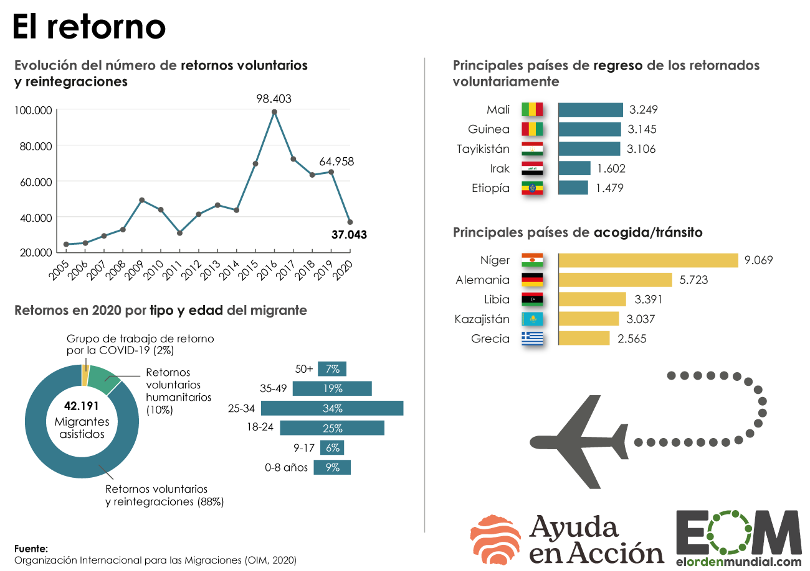

# Comentario Infografía 2
Este análisis se ha realizado en base a la infografía publicada en El Orden Mundial, recuperado del siguiente enlace:  https://elordenmundial.com/mapas-y-graficos/retorno-voluntario-migrantes/

La infografía escogida ha sido extraída de la página web de El Orden Mundial. La fuente es la *Organización Internacional para las Migraciones, 2020*
En esta imagen se habla del retorno voluntario de migrantes, es de tipo social y demográfica. El formato es estático (no hace ningún tipo de movimiento ni nada por el estilo.
Es una infografía dividida en 4 secciones en la que la primera sirve como base para el resto de la infografía:
+ Evolución del número de retornos voluntarios y reintegraciones
+ Retornos en 2020 por tipo y edad del migrante 
+ Principales países de regreso de los retornados voluntariamente 
+ Principales países de acogida / tránsito

Es interesante destacar cómo estos gráficos van variando su estética, lo cual puede ser beneficioso para que el lector no se aburra con la información. Así mismo, es fundamental atender a la importancia que tiene la estética en una infografía. Los datos por sí mismos, si no son correctamente interpretados o expuestos pierden parte de su valor.  
Es estático y no destaca detalles, sino que simplemente se expone todo de manera general. 
En la evolución temporal se destaca el año en el que más hubo migraciones, así como el pasado año 2019, para compararse con 2020.
La infografía cuenta con una serie de titulos cortos que sitúan al lector en la parte de la infografía que vaya a leer. 
Así pues también incluye círculos con datos alfanuméricos, porcentajes y diferentes franjas que representan esos datos expuestos. 
Es un gráfico muy sencillo de interpretar. Un aspecto interesante es que en el apartado más referido a los países se incluye el nombre y bandera de los mismos. La bandera hace que la infografía sea más visual y atractiva, mientras que el nombre da ese dato preciso para las personas que no sepan identificar el país solo por su bandera. 
En la página web de El Orden Mundial, figura el gráfico y debajo de este un texto bajo el título de **Descripción del Gráfico** que acompaña a la infogradía y aporta contexto y mayor información sobre los actores implicados en esta situación. 
Así mismo, es destacable la imagen que hay de un avión que refleja el retorno del mismo, algo que también ayuda a que no sea todo datos y que haya elementos visuales que llamen la atención sobre el lector. 
