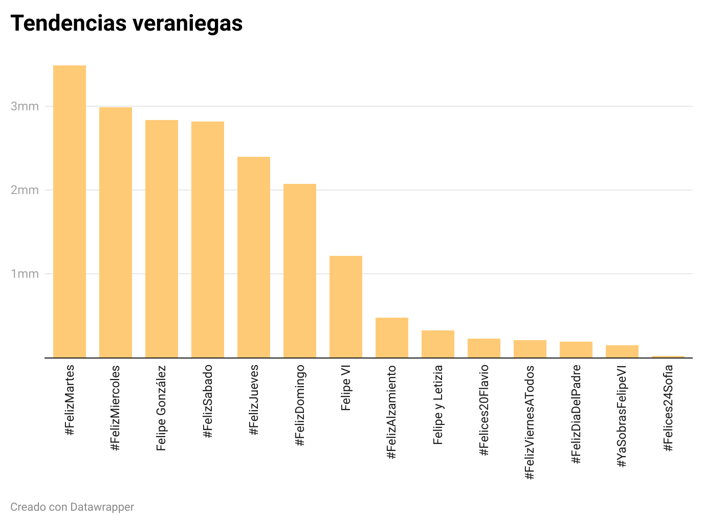
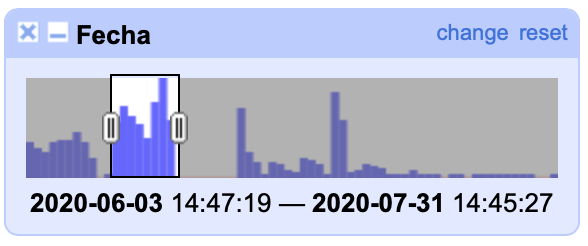
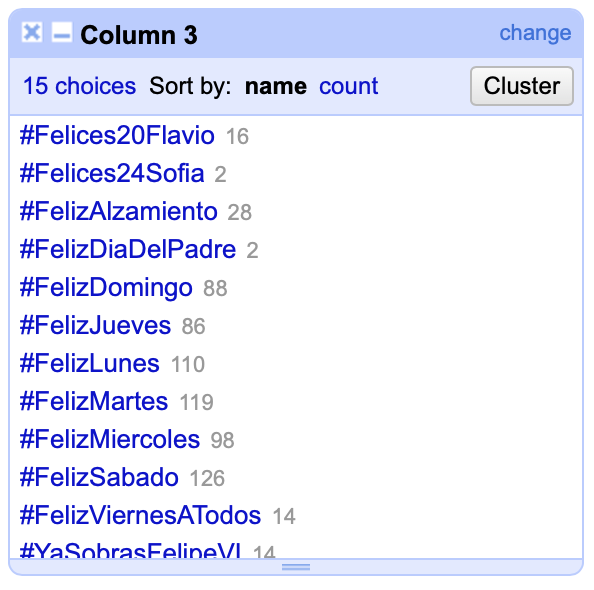
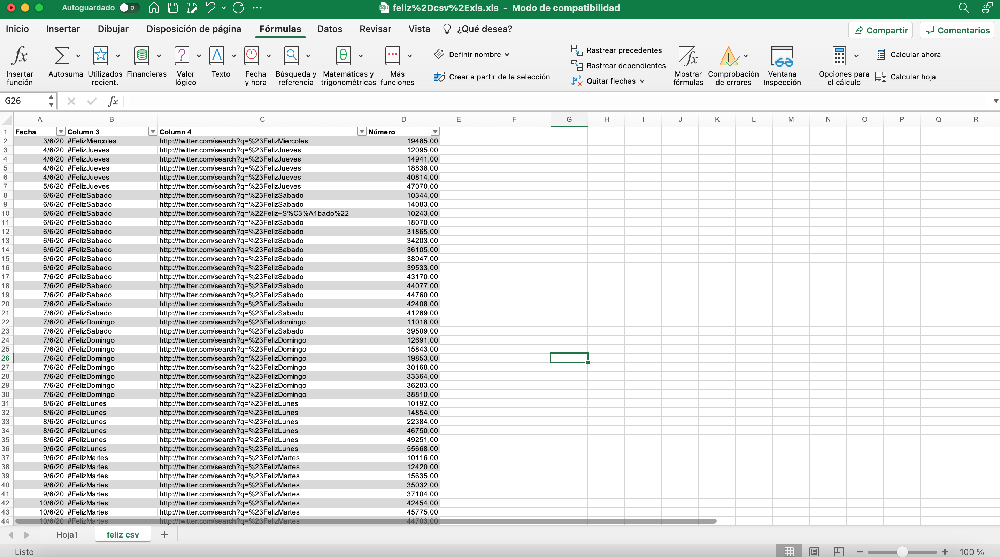

# Práctica 3: Gráfico con Datawrapper
## Gráfico realizado

Este gráfico se ha construido utilizando [Datawrapper](https://www.datawrapper.de)
En el presente gráfico se recogen las tendencias más influyentes en Twitter durante las siguientes fechas:
+ **03/06/2020 - 31/07/2020** 

Se ha utilizado este rango de tiempo puesto que coincide con los días en los que los usuarios de Twitter publicaron mayor número de tweets. Precisamente esta fecha coincide con la **desescalada del confinamiento de 2020**. Lo que muestran estos datos es que parece que al comenzar la "nueva normalidad", los internautas comenzaron a publicar más tweets. Lo que se pretendía con esta elección de datos es observar cuáles fueron las tendencias en RRSS de ese momento de desescalada para los usuarios. 

## El proceso de creación 

##### OpenRefine
Esta herramienta se ha utilizado para poder limpiar y analizar el primer fichero ** Feliz.csv** que contenía los datos que se han tomado para realizar el presente gráfico. En primer lugar se ha abierto el proyecto y se le ha dado a cada columna el valor que le correspondía (fecha, texto, número). 
Tras esto se han creado diferentes cuadros para poder filtrar los datos que se iban a utilizar. De la columna de fechas se ha creado una herramienta de filtro timeline. El primer paso ha sido eliminar los datos anteriores a 2020. De esta forma ya se ha delimitado por fechas el rango que se pretendía tratar. No obstante, no era suficiente, y se ha seguido limitando hasta llegar a esos datos relativos a los meses de mayor tráfico de tweets, tal como se observa en la siguiente imagen:

Después se ha creado otro cuadro para filtrar por texto (desde la columna que recogía los hashtag y nombres de tendencias). Se ha hecho **cluster** para unir aquellas tendencias que, aunque escritas de forma distinta, resultasen lo mismo. 

No obstante, en este fichero, algunas de las tendencias no reflejaban el número de tweets publicados. Para eliminar aquellos que no contenían la información necesaria se ha filtrado la columna de número:
Número > Facet > Customized Facets > Facet by Null > Delete True 

Ya se tenían todos los hashtag y tendencias correspondientes a esas fechas, con el número de tweets publicados correspondientes. Sin embargo, las tendencias se repetían, puesto que cada una estaba ligada a un día concreto. Es decir, había varios #FelizMiércoles, por cada semana incluida en ese rango de fechas. En este análisis no se necesita saber cuántos Feliz Miércoles hubo, sino que interesa saber el total de veces que se felicitó un miércoles en el rango antes indicado. Por ello se ha descargado el archivo en formato excel (.xls)

##### Excel

Tras esto se ha hecho SUMAR.SI para sumar todos aquellos tweets que compartían la misma tendencia pero no la misma fecha. Con las cantidades resultantes se ha creado un nuevo archivo CSV. 

##### Datawrapper
Con este nuevo archivo CSV se ha creado directamente el gráfico en Datawrapper. El gráfico elegido ha sido el de barras para poder mostrar con claridad la diferencia entre las cantidades de tweets de cada tendencia. Además se ha ordenado de mayor a menor influencia las tendencias para que se observe mejor la posición de cada una de ellas. 
El color empleado se ha escogido en consonancia con los datos que se estaban proporcionando. El contenido tiene que ver con meses referidos al verano, o cercanos a él. De tal forma que se ha apostado por un amarillo/naranja suave que recuerda a la calidez del verano. 
