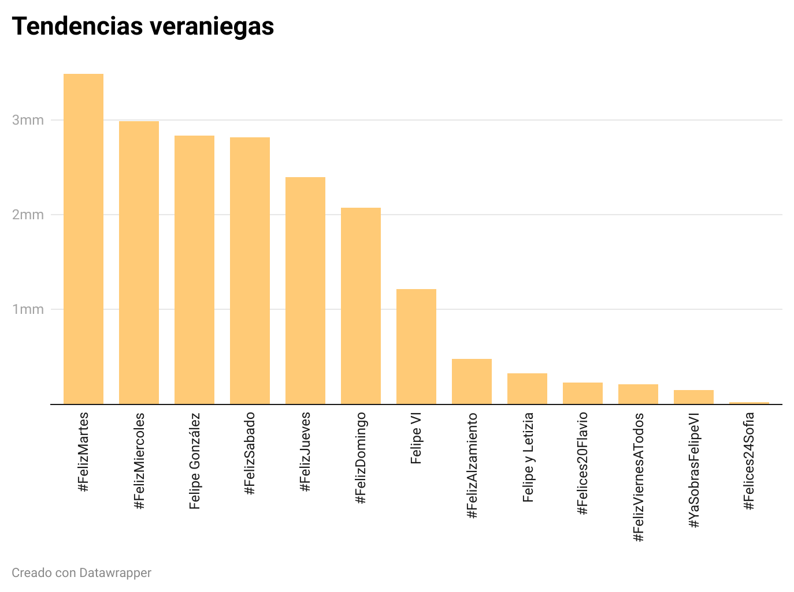

# Felices días veraniegos
A continuación se exponen de manera gráfica los datos relativos a las tendencias más influyentes en Twitter. Han sido recuperadas a través de un tratamiento de datos utilizando diferentes herramientas que a continuación serán explicadas. 

## Gráfico 1 realizado

Este gráfico se ha construido utilizando [Datawrapper](https://www.datawrapper.de)

En el presente gráfico se recogen las tendencias más influyentes en Twitter durante las siguientes fechas:
+ **03/06/2020 - 31/07/2020** 

Se ha utilizado este rango de tiempo puesto que coincide con los días en los que los usuarios de Twitter publicaron mayor número de tweets. Precisamente esta fecha coincide con la **desescalada del confinamiento de 2020**. Lo que muestran estos datos es que parece que al comenzar la "nueva normalidad", los internautas comenzaron a publicar más tweets. Lo que se pretendía con esta elección de datos es observar cuáles fueron las tendencias en RRSS de ese momento de desescalada para los usuarios. 

##### Contexto
En la actualidad las Redes Sociales suponen una herramienta muy potente de comunicación para los usuarios que las consumen. Twitter se alza como una de las redes con mayor popularidad entre los internautas de la sociedad digital. La plataforma del "pájaro azul" permite que cada usuario comparta sus impresiones sobre aquellos temas que le parezcan relevantes. El uso del hashtag (#) permite agrupar diferentes tweets dentro de una misma temática para que su búsqueda sea más sencilla.

**Los no tan felices años 20**
La pandemia de la Covid-19 asoló el planeta y obligó a millones de personas a confinarse en su casa. Fue entonces cuando la tecnología se hizo más necesaria que nunca. Las Redes Sociales se convirtierón realmente en la verdadera ventana al mundo. Permitieron no solo que las personas estuviesen conectadas, sino que también se permitió innovar en diferentes ámbitos del día a día. 

El momento que todo el mundo estaba esperando, esa ansiada desescalada comenzó el 10 de mayo de 2020 en España. Sin embargo, pocos fueron los territorios que pudieron disfrutar de tan la tan deseada -y temida- "nueva normalidad". Este proceso fue prolongándose en el tiempo, y fue en junio verdaderamente cuando se comenzó a atisbar la salida de casa. 

Tal como se ha comentado anteriormente se han tomado unas fechas concretas. Precisamente es curioso como a pesar de que durante 2020 las RRSS fueron tan "esperanzadoras" y necesarias, es precisamente al terminar el confinamiento cuando más interacciones se hicieron. Lo cual puede indicar que en realidad los diferentes usuarios tienen más tendencia a publicar cosas de su día a día de manera cotidiana. Es decir, llegó un momento que el confinamiento no servía, por así decirlo, para explotar las RRSS y compartir impresiones con el mundo. También puede significar que las RRSS son un reflejo del estado de ánimo de sus usuarios, y que estos solo muestran los momentos en los que pueden hacer cosaás o están de mejor humor. No obstante, esto son posibles apreciaciones, para hacer un análisis más exhaustivo es neecesario atender a más datos y diferentes factores. 

La tendencia más "felicitada" es la de los martes. Esto puede ser llamativo en principio, porque podría pensarse que los fines de semana serían aquello más citado. Sin embargo, esto podría deberse a que los viernes, sábados y domingos las personas ya están desconectadas de RRSS y los martes sienten mayor necesidad de estar conectados con otros usuarios. 

Así pues es interesante observar, y que cada lector saque sus propias conclusiones también, cómo quedaría representado el porcentaje de felicitaciones exclusivamente de los días de la semana:

## El proceso de creación 

##### OpenRefine
Esta herramienta se ha utilizado para poder limpiar y analizar el primer fichero **Feliz.csv** que contenía los datos que se han tomado para realizar el presente gráfico. En primer lugar se ha abierto el proyecto y se le ha dado a cada columna el valor que le correspondía (fecha, texto, número). 
Tras esto se han creado diferentes cuadros para poder filtrar los datos que se iban a utilizar. De la columna de fechas se ha creado una herramienta de filtro timeline. El primer paso ha sido eliminar los datos anteriores a 2020. De esta forma ya se ha delimitado por fechas el rango que se pretendía tratar. No obstante, no era suficiente, y se ha seguido limitando hasta llegar a esos datos relativos a los meses de mayor tráfico de tweets, tal como se observa en la siguiente imagen:

Después se ha creado otro cuadro para filtrar por texto (desde la columna que recogía los hashtag y nombres de tendencias). Se ha hecho **cluster** para unir aquellas tendencias que, aunque escritas de forma distinta, resultasen lo mismo. 

No obstante, en este fichero, algunas de las tendencias no reflejaban el número de tweets publicados. Para eliminar aquellos que no contenían la información necesaria se ha filtrado la columna de número:
**Número > Facet > Customized Facets > Facet by Null > Delete True**

Ya se tenían todos los hashtag y tendencias correspondientes a esas fechas, con el número de tweets publicados correspondientes. Sin embargo, las tendencias se repetían, puesto que cada una estaba ligada a un día concreto. Es decir, había varios #FelizMiércoles, por cada semana incluida en ese rango de fechas. En este análisis no se necesita saber cuántos Feliz Miércoles hubo, sino que interesa saber el total de veces que se felicitó un miércoles en el rango antes indicado. Por ello se ha descargado el archivo en formato excel (.xls)

##### Excel

Tras esto se ha hecho SUMAR.SI para sumar todos aquellos tweets que compartían la misma tendencia pero no la misma fecha. Con las cantidades resultantes se ha creado un nuevo archivo CSV. 

##### Datawrapper
Con este nuevo archivo CSV se ha creado directamente el gráfico en Datawrapper. El gráfico elegido ha sido el de barras para poder mostrar con claridad la diferencia entre las cantidades de tweets de cada tendencia. Este tipo de representaciones atiende muy bien a aquellos datos referidos a patrones o tendencias. Además se ha ordenado de mayor a menor influencia las tendencias para que se observe mejor la posición de cada una de ellas. 
El color empleado se ha escogido en consonancia con los datos que se estaban proporcionando. El contenido tiene que ver con meses referidos al verano, o cercanos a él. De tal forma que se ha apostado por un amarillo/naranja suave que recuerda a la calidez del verano. 

##### Gráficos Complementarios

Recuperando el archivo final de Excel se han tomado los hashtag relativos a los días de la semana exclusivamente y se ha hecho un sumatorio de los tweets totales de días de la semana. En primer lugar se ha comparado con el resto de tweets y posteriormente se ha visto la comparación entre los diferentes días y cuál se felicita más. 

:+1:
